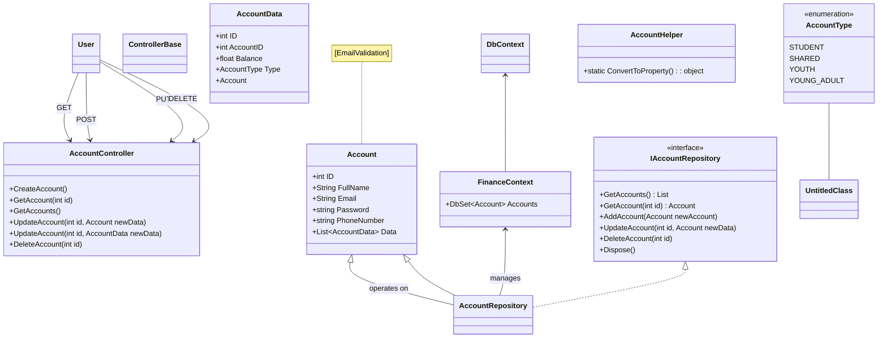

```mermaid
classDiagram
direction TB
    class User {
    }

    class ControllerBase {
    }

    class AccountController {
	    +CreateAccount()
	    +GetAccount(int id)
	    +GetAccounts()
	    +UpdateAccount(int id, Account newData)
	    +UpdateAccount(int id, AccountData newData)
	    +DeleteAccount(int id)
    }

    class Account {
	    +int ID
	    +String FullName
	    +String Email
	    +string Password
	    +string PhoneNumber
	    +List~AccountData~ Data
    }

    class AccountData {
	    +int ID
	    +int AccountID
	    +float Balance
	    +AccountType Type
	    +Account
    }

    class DbContext {
    }

    class FinanceContext {
	    +DbSet~Account~ Accounts
    }

    class AccountType {
	    STUDENT
	    SHARED
	    YOUTH
	    YOUNG_ADULT
    }

    class AccountRepository {
    }

    class IAccountRepository {
	    +GetAccounts() List
	    +GetAccount(int id) Account
	    +AddAccount(Account newAccount)
	    +UpdateAccount(int id, Account newData)
	    +DeleteAccount(int id)
	    +Dispose()
    }

    class AccountHelper {
	    +static ConvertToProperty() : object
    }

    class UntitledClass {
    }

	<<enumeration>> AccountType
	<<interface>> IAccountRepository

	note for Account "[EmailValidation]"

    IAccountRepository <|.. AccountRepository
    Account <|-- AccountRepository : operates on
    DbContext <-- FinanceContext
    FinanceContext <-- AccountRepository : manages
    Account <|-- AccountRepository
    User --> AccountController : GET
    User --> AccountController : POST
    User --> AccountController : PUT
    User --> AccountController : DELETE
    AccountType -- UntitledClass


```