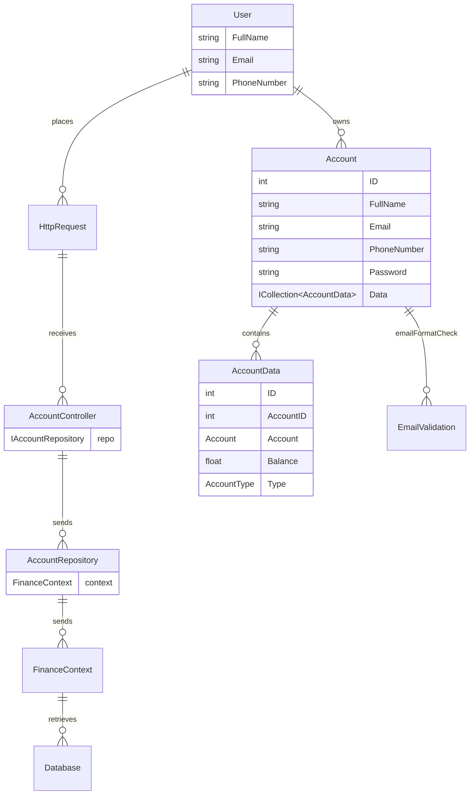

```mermaid
erDiagram
User ||--o{ HttpRequest : places
User ||--o{ Account : owns
HttpRequest ||--o{ AccountController : receives
AccountController ||--o{ AccountRepository : sends
AccountRepository ||--o{ FinanceContext : sends
FinanceContext ||--o{ Database : retrieves
Account ||--o{ AccountData : contains
Account ||--o{ EmailValidation : emailFormatCheck
User {
string FullName
string Email
string PhoneNumber
}

    AccountController {
        IAccountRepository repo
    }

    AccountRepository { 
        FinanceContext context
    }

    Account {
        int ID
        string FullName
        string Email
        string PhoneNumber
        string Password
        ICollection~AccountData~ Data
    }

    AccountData{
        int ID
        int AccountID
        Account Account
        float Balance
        AccountType Type
    }
```