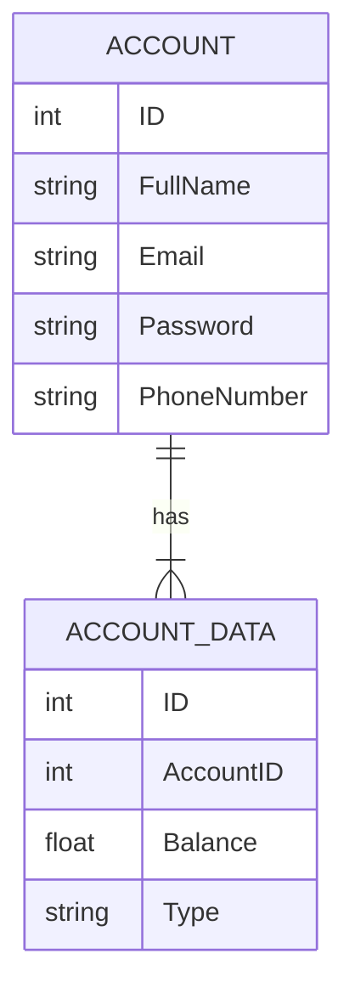

```mermaid
erDiagram
    ACCOUNT { 
        int ID
        string FullName
        string Email
        string Password
        string PhoneNumber
    }
    
    ACCOUNT_DATA{
        int ID
        int AccountID
        float Balance
        string Type
    }
    
    ACCOUNT ||--|{ ACCOUNT_DATA : has
    
```