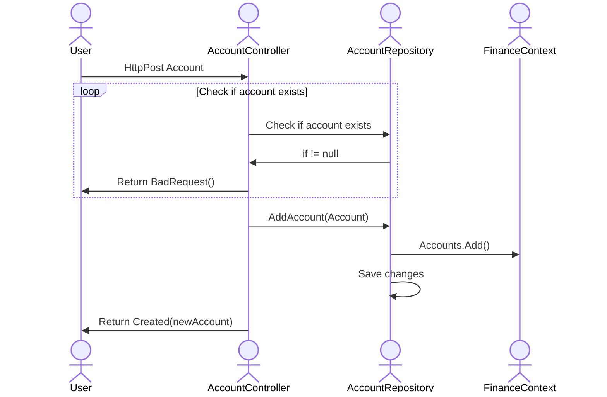

```mermaid
sequenceDiagram
    actor User
    actor AccountController
    actor AccountRepository
    actor FinanceContext

        User->>AccountController: HttpPost Account
        loop Check if account exists
        AccountController->>AccountRepository: Check if account exists
        AccountRepository->>AccountController: if != null 
        AccountController->>User: Return BadRequest()
        end
        AccountController->>AccountRepository: AddAccount(Account)
        AccountRepository->>FinanceContext: Accounts.Add() 
        AccountRepository->>AccountRepository : Save changes
        AccountController->>User : Return Created(newAccount)

```