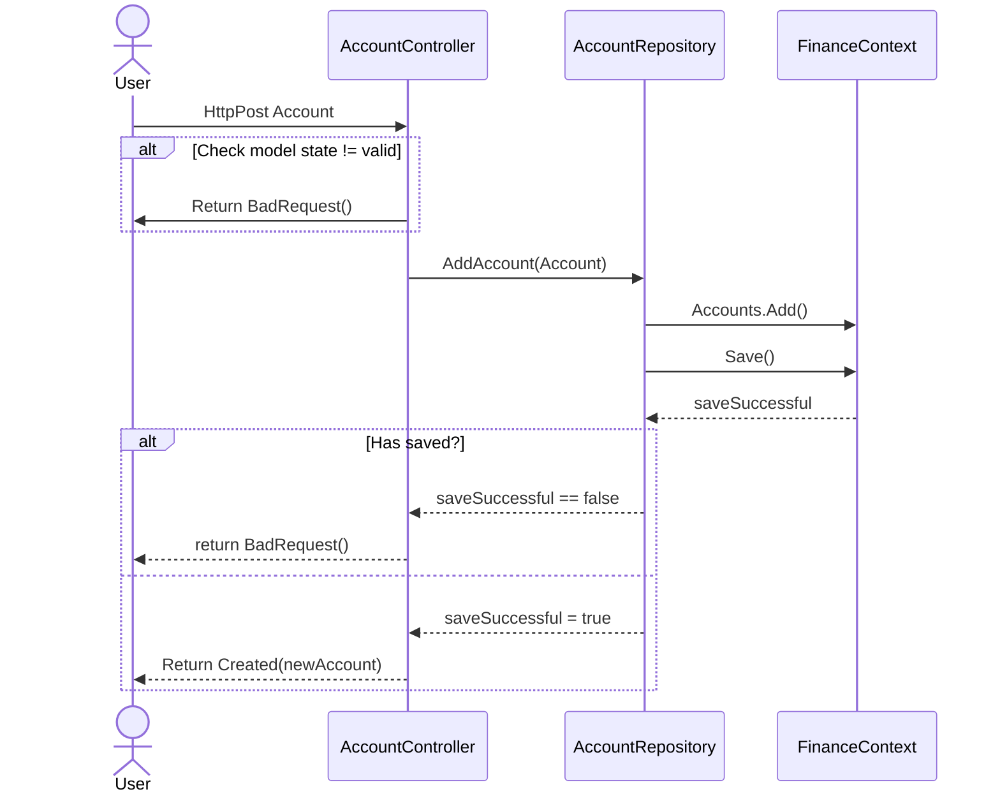

```mermaid
sequenceDiagram
    actor User

        User->>AccountController: HttpPost Account
        alt Check model state != valid
        AccountController->>User: Return BadRequest()
        end
        AccountController->>AccountRepository: AddAccount(Account)
        AccountRepository->>FinanceContext: Accounts.Add() 
        AccountRepository->>FinanceContext : Save()
        FinanceContext-->>AccountRepository : saveSuccessful
        
        alt Has saved?
        AccountRepository-->>AccountController : saveSuccessful == false
        AccountController-->>User : return BadRequest()
        else 
            AccountRepository-->>AccountController : saveSuccessful = true
            AccountController-->>User : Return Created(newAccount)
        end
        
```