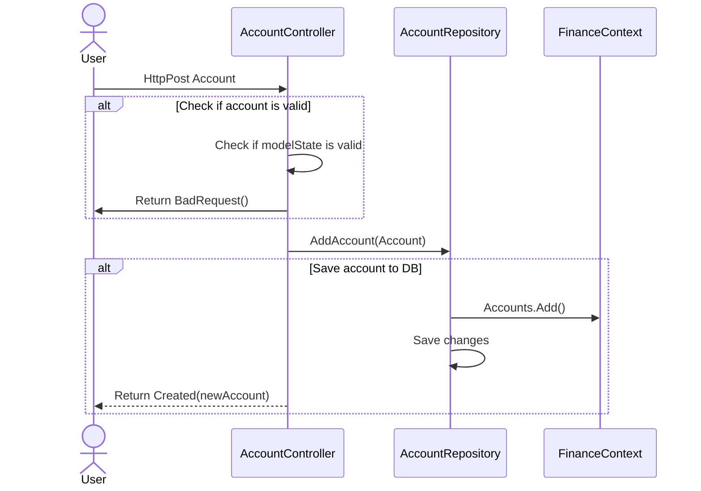

```mermaid
sequenceDiagram
    actor User

        User->>AccountController: HttpPost Account
        alt Check if account is valid
        AccountController->>AccountController: Check if modelState is valid
        AccountController->>User: Return BadRequest()
        end
        AccountController->>AccountRepository: AddAccount(Account)
        
        alt Save account to DB
        AccountRepository->>FinanceContext: Accounts.Add() 
        AccountRepository->>AccountRepository : Save changes
        AccountController-->>User : Return Created(newAccount)
        end
        
```