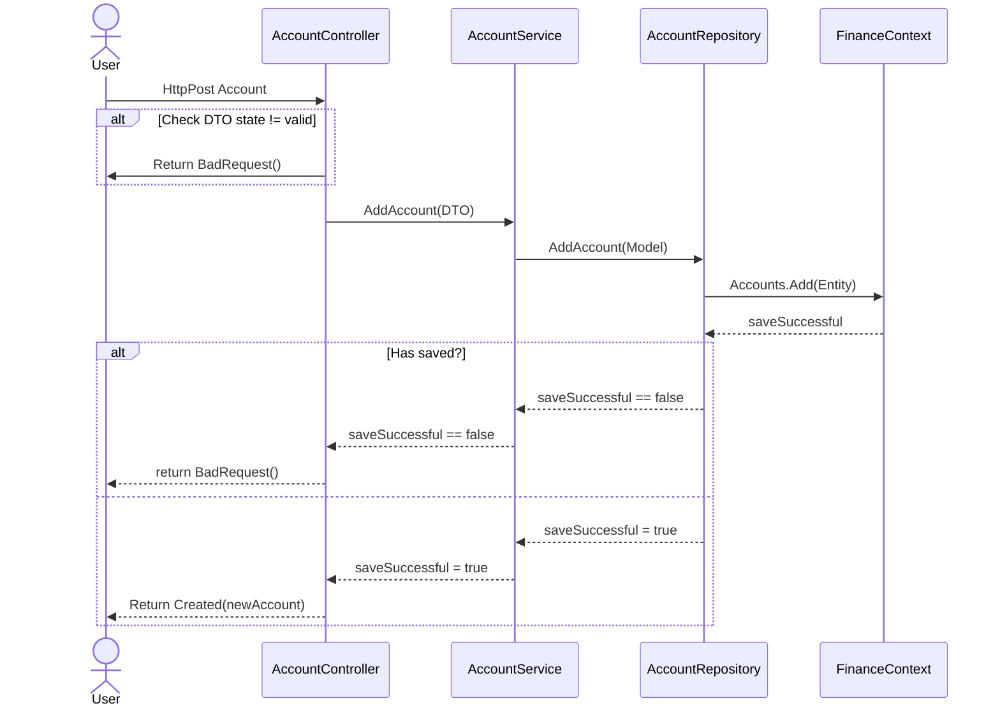

```mermaid
sequenceDiagram
    actor User

        User->>AccountController: HttpPost Account
        alt Check DTO state != valid
        AccountController->>User: Return BadRequest()
        end
        AccountController->>AccountService: AddAccount(DTO)
        AccountService->>AccountRepository: AddAccount(Model)
        AccountRepository->>FinanceContext : Accounts.Add(Entity)
        FinanceContext-->>AccountRepository : saveSuccessful
        
        alt Has saved?
        AccountRepository-->>AccountService : saveSuccessful == false
        AccountService-->>AccountController : saveSuccessful == false
        AccountController-->>User : return BadRequest()
        else
            AccountRepository-->>AccountService : saveSuccessful = true
            AccountService-->>AccountController : saveSuccessful = true
            AccountController-->>User : Return Created(newAccount)
        end
        
```